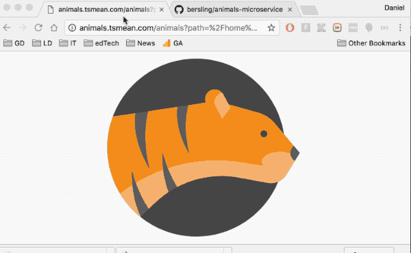

# Find & Fetch Animal SVGs



Simply find & use some animal svgs.

Note that the svgs are not included in this repository due
to copyright issues.

Rather you can use this repo if you want to have
a look how you could build such an API using nodeJS + express in under 100 lines of code!

Simply check out the `server.js` file.

The api works as follows.

Finding an animal:
```
/find?q=tiger
```
will return something like:

```
{
  "path": "/home/ubuntu/animals/animals/141684-animal-collection/svg/tiger.svg",
  "urlEncodedPath": "%2Fhome%2Fubuntu%2Fanimals%2Fanimals%2F141684-animal-collection%2Fsvg%2Ftiger.svg"
}
```

then get the svg:
```
/animals?path=%2Fhome%2Fubuntu%2Fanimals%2Fanimals%2F141684-animal-collection%2Fsvg%2Ftiger.svg
```

That's it!
